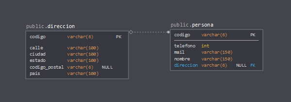
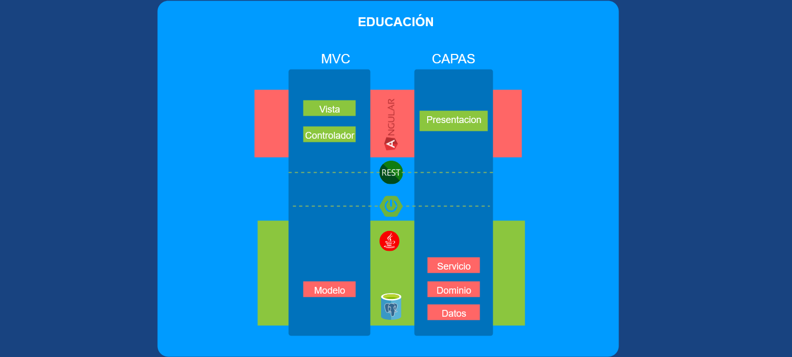

# Educacion

### BD - PostgreSQL

### Presentacion en Angular 7 , Html, bootstrap
### Construccion Maven
### Backend Spring Boot
### Integracion Front-Back REST
### Spring DataJPA-Hibernate
### setters, getters, validacion con anotaciones de modelos, concatenacion de Strings con StringBuilders(toString()).

# Construccion y despliegue

### Back

Se utilizo maven para la construccion del proyecto y para desplegarlo se instalo el pluggin **Spring Tools 4** en Ecipse, luego click derecho sobre el proyecto **Run AS** , **Spring Boot App**

### Front

Con el CLI de angular 7 instalado, ubicarse en la carpeta del proyecto, ejecutar el comando **ng serve** 

# Capas de la aplicacion

Se utiliza un modelo de capas y un modelado MVC donde : 

## 1 Presentacion

Se centra en la utilizacion de **Angular** para soportar **Vista - Controlador** dejando a un lado la complejidad de negocio detras de la siguiente capa.

#### artefactos : 
Modulo  y componentes de angular.

## 2 Servicio

Esta capa utiliza **Spring boot** para exponer los servicios ocultando la complejidad y logica de negocio, dando flexibilidad al desarrollo, de esta forma se puede cambiar la capa de presentacion facilmente.

#### artefactos : 
Modulo Spring-Boot con sus clases **@RestControler** co.com.obligacion.servicio.rest.

## 3 Dominio 

Para manejar logica de negocio 

#### artefactos : 
Interfaces co.com.obligacion.negocio.interfaz y clases co.com.obligacion.negocio.implementacion tipo **@Service**.

## 4 Acceso a Datos 

Capa dedicada unicamente a persistencia de datos utilizando **Spring Data-JPA** 

#### artefactos : 
Entidades co.com.obligacion.negocio.persistencia.entidad tipo **@Entity** 
Interfaces co.com.obligacion.negocio.implementacion tipo **@Repository**.
